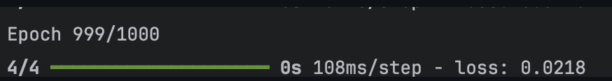

# 인터파크티켓 자동화프로그램 이용한 예약 메크로 입니다.

## 개요
> 자동화 프로그램을 통해 전반적인 html구조를 학습하며, 
> 이미지 학습을 통해 웹 사이트의 이미지와 일치 확률을 98%까지 학습하기 위함

### 예약홈페이지 참고 예시 자료입니다

### 로그인 페이지 자동화 구현

### 원하는 날짜 설정 자동화 구현

### 팝업창 종료 자동화 구현

### 안심예매, 부정방지 예매 자동입력 구현

### 결제하기 및 사용자 정보입력 자동화 구현

### 학습 이미지 오차율 0.2% 학습

## 빌드환경
* Visual Studio 2022이상
* Python
* TensorFlow

## 테스트 환경
* Mac / Window 10 이상
* Python 사용 가능한 툴

> 추후에 GUI버전으로 구현하겠습니다.  
> 출처 https://tickets.interpark.com/goods/24002387
